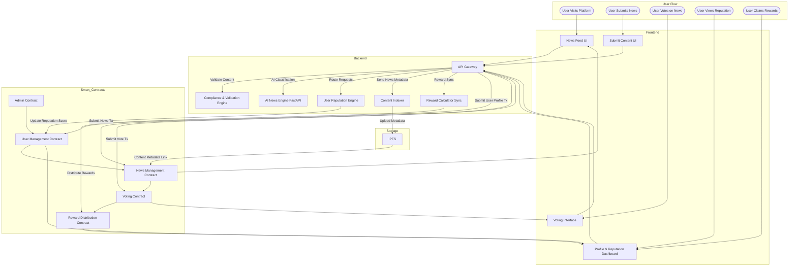

# Zentro

a decentralized news curation and reputation protocol. It transforms news publication, moderation, and reward distribution into transparent, verifiable smart contract processes powered by Ethereum.
 Users publish news, vote, build reputation, and earn token rewards — all enforced by immutable on-chain logic.

---
## ✨ Key Features

- **Decentralized News Publishing:** Users submit verified content directly to smart contracts.
- **Reputation-Driven Governance:** Voting power increases with user reputation and past contributions.
- **Anti-Sybil Voting:** Weighted voting & cooldown periods to reduce spam manipulation.
- **Tokenized Rewards:**  Voters and contributors earn rewards distributed transparently on-chain.
- **Modular Contract System:**  Admin control, user management, news registry, voting engine, and reward module as separate contracts.
- **Auditable History:** All actions — submissions, likes, votes, rewards — are traceable on-chain.
  
---

### Workflow

1. **User Registration**
   - New users register through the User Management contract.
   - Profile & reputation score initialized.

2. **Content Publishing**
   - Registered users publish news with metadata stored on IPFS.
   - Admin contract validates or flags malicious reports.

3. **Voting**
   - Users vote on articles using the Voting Contract.
   - Votes are weighted by reputation score.
   - High-quality content receives better weight and engagement.

4. **Reward Distribution**
   - Smart contract automatically calculates each user’s share.
   - Rewards distributed to:
        - Content creators
        - Accurate voters
        - Top contributors (reputation-based bonuses)
---

## 🧩 Tech Stack
| Layer             | Technologies                                 |
| ----------------- | -------------------------------------------- |
| **Smart Contracts:**      | Hardhat, Solidity, ethers.js, OpenZeppelin |
| **Frontend**       | Next.js 15, TypeScript, Tailwind, Zustand, Starknet.js   |
| **Backend**    | NestJS, TypeORM, PostgreSQL, BullMQ   |
| **Engine**    | Python, FastAPI   |
| **Storage** | IPFS |
| **Blockchain**  | Ethereum / EVM-compatible networks


---

## 🔄 System Architecture & User Flow

## 🏗️ Project Structure

```
Zentro/
├── contracts/                                  # Smart Contracts
│
├── backend/                                    # Server Logic
|
├── engine/                                     # AI
|
├── frontend/                                   # UI
│
└── docs/                                      # Documentation
    ├── architecture.md
    ├── contract_design.md
    ├── sdk_usage.md
    └── api_reference.md

```
---
